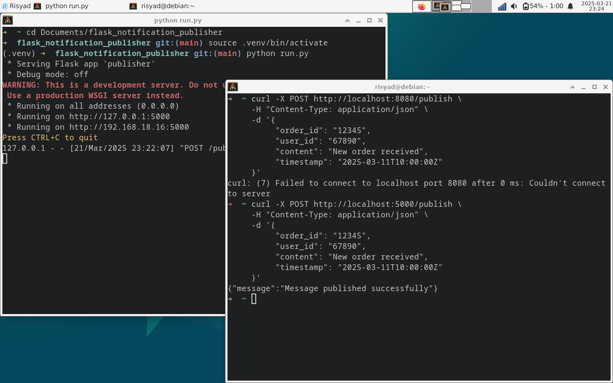

# Notification Service dengan RabbitMQ dan Flask 🚀

### screenshot


### Buat sebuah virtual environment
```
python3 -m venv .venv
```
### Aktifkan virtual environment
```
source .venv/bin/activate
```

### Install requirements
```
pip install -r requirements.txt
```

### Jalankan server
```
python run.py
```

### Menguji aplikasi
```
curl -X POST http://localhost:5000/publish \
     -H "Content-Type: application/json" \
     -d '{
          "order_id": "12345",
          "user_id": "67890",
          "content": "New order received",
          "timestamp": "2025-03-11T10:00:00Z"
     }'
```
